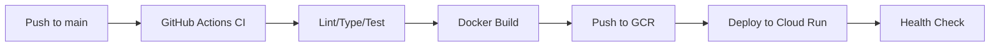

# CI/CD Deployment Strategy for Google Cloud Run

## Overview

This document describes the **recommended CI/CD approach** for deploying Next.js applications to Google Cloud Run, based on lessons learned from multiple deployment strategies.

## Recommended Approach: Docker Build in GitHub Actions ✅

After testing multiple deployment methods, **building with Docker directly in GitHub Actions** is the preferred strategy because it:

- ✅ **Faster builds** (~2-3 minutes vs 10+ minutes with Cloud Build)
- ✅ **Simpler workflow** — no external build service coordination
- ✅ **Better log streaming** — build logs appear directly in GitHub Actions
- ✅ **Cost effective** — uses GitHub Actions runners instead of Cloud Build quota
- ✅ **Fewer permissions needed** — no Cloud Build API or staging bucket access required
- ✅ **Immediate feedback** — errors surface instantly in the workflow

### What We Tried

| Method | Result | Notes |
|--------|--------|-------|
| **Docker build in GitHub Actions** | ✅ **RECOMMENDED** | Fast, simple, reliable |
| Cloud Build (`gcloud builds submit`) | ⚠️ Works but slower | 10min builds, complex permissions, log streaming issues |
| Cloud Build with multiple tags | ❌ Failed | `gcloud builds submit` only accepts one `--tag` |
| Firebase App Hosting | ⚠️ Alternative | Good for Firebase-heavy apps, different deployment model |

## Architecture




## Prerequisites & Setup

### 1. Required GCP Services

Enable these APIs in your GCP project:

```bash
PROJECT="your-gcp-project-id"

gcloud services enable run.googleapis.com --project="$PROJECT"
gcloud services enable containerregistry.googleapis.com --project="$PROJECT"
gcloud services enable artifactregistry.googleapis.com --project="$PROJECT"
gcloud services enable secretmanager.googleapis.com --project="$PROJECT"
```

### 2. Service Account Setup

Create a service account for GitHub Actions with the minimum required permissions:

```bash
PROJECT="your-gcp-project-id"
SA_NAME="github-actions-deployer"
SA_EMAIL="${SA_NAME}@${PROJECT}.iam.gserviceaccount.com"

# Create service account
gcloud iam service-accounts create "$SA_NAME" \
  --project="$PROJECT" \
  --display-name="GitHub Actions Deploy Service Account"

# Grant required IAM roles
gcloud projects add-iam-policy-binding "$PROJECT" \
  --member="serviceAccount:${SA_EMAIL}" \
  --role="roles/run.admin" \
  --condition=None

gcloud projects add-iam-policy-binding "$PROJECT" \
  --member="serviceAccount:${SA_EMAIL}" \
  --role="roles/iam.serviceAccountUser" \
  --condition=None

gcloud projects add-iam-policy-binding "$PROJECT" \
  --member="serviceAccount:${SA_EMAIL}" \
  --role="roles/artifactregistry.writer" \
  --condition=None

gcloud projects add-iam-policy-binding "$PROJECT" \
  --member="serviceAccount:${SA_EMAIL}" \
  --role="roles/storage.admin" \
  --condition=None

# Optional: Only needed if using Cloud Build instead of Docker
# gcloud projects add-iam-policy-binding "$PROJECT" \
#   --member="serviceAccount:${SA_EMAIL}" \
#   --role="roles/cloudbuild.builds.editor" \
#   --condition=None
```

### 3. IAM Roles Explained

| Role | Purpose | Required For |
|------|---------|--------------|
| `roles/run.admin` | Deploy and manage Cloud Run services | ✅ Always required |
| `roles/iam.serviceAccountUser` | Act as the Cloud Run runtime service account | ✅ Always required |
| `roles/artifactregistry.writer` | Push Docker images to GCR/Artifact Registry | ✅ Docker build method |
| `roles/storage.admin` | Access Cloud Storage (GCR backend) | ✅ Docker build method |
| `roles/cloudbuild.builds.editor` | Submit builds to Cloud Build | ⚠️ Only for Cloud Build method |
| `roles/secretmanager.secretAccessor` | Read secrets from Secret Manager (optional) | ⚠️ If workflow reads secrets |

### 4. Create and Upload Service Account Key

```bash
# Create JSON key
gcloud iam service-accounts keys create /tmp/gcp-sa-key.json \
  --iam-account="$SA_EMAIL" \
  --project="$PROJECT"

# Upload to GitHub as repository secret
gh secret set GCP_SA_KEY \
  --repo "OWNER/REPO" \
  --body "$(cat /tmp/gcp-sa-key.json)"

# Clean up local key file
rm -f /tmp/gcp-sa-key.json
```

**Alternative: Create and export in one step**

```bash
# Create key and save to file
gcloud iam service-accounts keys create gcp-sa-key.json \
  --iam-account="$SA_EMAIL" \
  --project="$PROJECT"

# View the key (optional - be careful not to leak)
cat gcp-sa-key.json

# Upload to GitHub
gh secret set GCP_SA_KEY < gcp-sa-key.json

# Or manually copy-paste the entire JSON into GitHub UI:
# GitHub → Settings → Secrets → Actions → New repository secret
# Name: GCP_SA_KEY
# Value: (paste entire JSON content)

# Secure cleanup
shred -vfz -n 10 gcp-sa-key.json 2>/dev/null || rm -f gcp-sa-key.json
```

### 5. Required GitHub Secrets

Set these secrets in your GitHub repository (Settings → Secrets and variables → Actions):

| Secret Name | Description | Example Value |
|-------------|-------------|---------------|
| `GCP_SA_KEY` | Service account JSON key (full JSON) | `{"type":"service_account",...}` |
| `GCP_PROJECT` | GCP project ID | `my-project-123456` |
| `CLOUD_RUN_SERVICE` | Cloud Run service name | `mermaid-exporter` |
| `CLOUD_RUN_REGION` | GCP region | `us-central1` |
| `NEXT_PUBLIC_FIREBASE_API_KEY` | Firebase API key | `AIza...` |
| `NEXT_PUBLIC_FIREBASE_PROJECT_ID` | Firebase project ID | `my-firebase-project` |
| `NEXT_PUBLIC_FIREBASE_APP_ID` | Firebase app ID | `1:123456:web:abc` |
| `NEXT_PUBLIC_FIREBASE_AUTH_DOMAIN` | Firebase auth domain | `my-project.firebaseapp.com` |
| `NEXT_PUBLIC_FIREBASE_STORAGE_BUCKET` | Firebase storage bucket | `my-project.appspot.com` |
| `NEXT_PUBLIC_FIREBASE_MESSAGING_SENDER_ID` | Firebase messaging sender ID | `123456789` |
| `GEMINI_API_KEY` | Google Gemini API key | `AIza...` |

**Quick setup using GitHub CLI:**

```bash
# Set infrastructure secrets
gh secret set GCP_PROJECT --body "your-project-id"
gh secret set CLOUD_RUN_SERVICE --body "mermaid-exporter"
gh secret set CLOUD_RUN_REGION --body "us-central1"

# Set Firebase secrets
gh secret set NEXT_PUBLIC_FIREBASE_API_KEY --body "your-api-key"
gh secret set NEXT_PUBLIC_FIREBASE_PROJECT_ID --body "your-project-id"
gh secret set NEXT_PUBLIC_FIREBASE_APP_ID --body "1:123:web:abc"
gh secret set NEXT_PUBLIC_FIREBASE_AUTH_DOMAIN --body "your-project.firebaseapp.com"
gh secret set NEXT_PUBLIC_FIREBASE_STORAGE_BUCKET --body "your-project.appspot.com"
gh secret set NEXT_PUBLIC_FIREBASE_MESSAGING_SENDER_ID --body "123456789"

# Set API keys
gh secret set GEMINI_API_KEY --body "your-gemini-key"
```

**Get Firebase configuration from Firebase Console:**

```bash
# Navigate to: Firebase Console → Project Settings → General → Your apps → Web app
# Or use Firebase CLI:
firebase apps:sdkconfig WEB

# Example output (JSON format):
{
  "apiKey": "AIzaSy...",
  "authDomain": "your-project.firebaseapp.com",
  "projectId": "your-project-id",
  "storageBucket": "your-project.appspot.com",
  "messagingSenderId": "123456789",
  "appId": "1:123456789:web:abc123"
}

# Extract and set secrets using jq:
firebase apps:sdkconfig WEB --json | jq -r '
  "gh secret set NEXT_PUBLIC_FIREBASE_API_KEY --body \(.apiKey)",
  "gh secret set NEXT_PUBLIC_FIREBASE_PROJECT_ID --body \(.projectId)",
  "gh secret set NEXT_PUBLIC_FIREBASE_APP_ID --body \(.appId)",
  "gh secret set NEXT_PUBLIC_FIREBASE_AUTH_DOMAIN --body \(.authDomain)",
  "gh secret set NEXT_PUBLIC_FIREBASE_STORAGE_BUCKET --body \(.storageBucket)",
  "gh secret set NEXT_PUBLIC_FIREBASE_MESSAGING_SENDER_ID --body \(.messagingSenderId)"
' | bash
```

**Get Gemini API Key:**

```bash
# Navigate to: https://aistudio.google.com/app/apikey
# Or use gcloud to create an API key:
gcloud alpha services api-keys create \
  --display-name="Gemini API Key for GitHub Actions" \
  --project="$PROJECT"

# Get the API key value:
gcloud alpha services api-keys get-key-string <KEY_ID> --project="$PROJECT"

# Set as GitHub secret:
gh secret set GEMINI_API_KEY --body "AIza..."
```

### 6. Runtime Secrets in GCP Secret Manager (Optional)

For production deployments, store sensitive runtime secrets in GCP Secret Manager and grant the Cloud Run service account access:

```bash
PROJECT="your-gcp-project-id"
RUNTIME_SA="123456-compute@developer.gserviceaccount.com"  # Cloud Run default SA

# Create secrets
echo -n "your-gemini-api-key" | gcloud secrets create GEMINI_API_KEY \
  --project="$PROJECT" \
  --data-file=-

# Grant Cloud Run service account access
gcloud secrets add-iam-policy-binding GEMINI_API_KEY \
  --project="$PROJECT" \
  --member="serviceAccount:${RUNTIME_SA}" \
  --role="roles/secretmanager.secretAccessor"
```

**Helper script:** Use `scripts/upload-secrets.sh` to bulk-upload from `.env.local`:

```bash
./scripts/upload-secrets.sh --project your-gcp-project-id --env-file .env.local
```

## Recommended Workflow Configuration

The complete workflow is in `.github/workflows/main.yml`. Key steps:

### CI Job (runs on all pushes/PRs)

```yaml
- name: Run ESLint
  run: npm run lint -- --max-warnings 0
  
- name: Run TypeScript type check
  run: npm run typecheck
  
- name: Run tests with coverage
  run: npm run test -- --ci --coverage
```

### Deploy Job (runs on push to main)

```yaml
- name: Authenticate to Google Cloud
  uses: google-github-actions/auth@v1
  with:
    credentials_json: ${{ secrets.GCP_SA_KEY }}

- name: Configure Docker for GCR
  run: gcloud auth configure-docker --quiet

- name: Build and push image (Docker)
  run: |
    TAG="${GITHUB_SHA:0:7}"
    IMAGE_TAG="gcr.io/${PROJECT}/${SERVICE}:${TAG}"
    IMAGE_LATEST="gcr.io/${PROJECT}/${SERVICE}:latest"
    
    docker build -t "$IMAGE_TAG" -t "$IMAGE_LATEST" .
    docker push "$IMAGE_TAG"
    docker push "$IMAGE_LATEST"
    
    DIGEST=$(gcloud container images describe "$IMAGE_TAG" --format='get(image_summary.digest)')
    echo "IMAGE_DIGEST=gcr.io/${PROJECT}/${SERVICE}@${DIGEST}" >> "$GITHUB_OUTPUT"

- name: Deploy to Cloud Run
  run: |
    gcloud run deploy "$SERVICE" \
      --image "$IMAGE_DIGEST" \
      --region "$DEFAULT_REGION" \
      --platform managed \
      --allow-unauthenticated \
      --port 8080 \
      --memory 512Mi \
      --cpu 1 \
      --min-instances 0 \
      --max-instances 10
```

## Common Issues & Solutions

### Issue: "Permission denied" when pushing to GCR

**Cause:** Service account lacks Artifact Registry write permissions.

**Solution:**
```bash
gcloud projects add-iam-policy-binding "$PROJECT" \
  --member="serviceAccount:${SA_EMAIL}" \
  --role="roles/artifactregistry.writer" \
  --condition=None
```

### Issue: "Service account key is not valid JSON"

**Cause:** Secret contains only the private key, not the full JSON.

**Solution:** Re-create the key and upload the **entire JSON file**:
```bash
gcloud iam service-accounts keys create /tmp/sa-key.json --iam-account="$SA_EMAIL"
gh secret set GCP_SA_KEY --body "$(cat /tmp/sa-key.json)"
rm /tmp/sa-key.json
```

### Issue: Cloud Build times out or fails

**Cause:** Using `gcloud builds submit` can be slow and has permissions issues.

**Solution:** Switch to Docker build method (recommended approach above).

### Issue: "No active gcloud account"

**Cause:** Authentication step failed or credentials not properly exported.

**Solution:** Use the `google-github-actions/auth@v1` action which handles this automatically.

## Deployment Verification

After successful deployment:

```bash
# Get service URL
SERVICE_URL=$(gcloud run services describe "$SERVICE" \
  --region="$REGION" \
  --format='value(status.url)')

# Test the service
curl -I "$SERVICE_URL"

# View recent logs
gcloud run services logs read "$SERVICE" --region="$REGION" --limit=50
```

## Security Best Practices

1. **Never commit secrets** — always use GitHub Secrets or GCP Secret Manager
2. **Use least-privilege IAM** — only grant roles actually needed
3. **Rotate service account keys** regularly (every 90 days recommended)
4. **Enable Binary Authorization** for production workloads
5. **Use VPC-SC** for regulated workloads
6. **Review Cloud Run IAM** — use `--no-allow-unauthenticated` for internal services

## Cost Optimization

- **Min instances = 0** — scale to zero when idle
- **Use `--cpu-throttling`** — save costs during idle periods  
- **Right-size memory/CPU** — start with 512Mi/1 CPU, adjust based on metrics
- **Set max instances** — prevent runaway costs from traffic spikes
- **Use request-driven scaling** — better than always-on instances

## Monitoring & Observability

```bash
# View service metrics
gcloud run services describe "$SERVICE" --region="$REGION"

# Stream logs
gcloud run services logs tail "$SERVICE" --region="$REGION"

# View in Cloud Console
echo "https://console.cloud.google.com/run/detail/${REGION}/${SERVICE}/metrics?project=${PROJECT}"
```

---

## Alternative: Cloud Build Method (Not Recommended)

If you must use Cloud Build instead of Docker:

**Additional permissions needed:**
```bash
gcloud projects add-iam-policy-binding "$PROJECT" \
  --member="serviceAccount:${SA_EMAIL}" \
  --role="roles/cloudbuild.builds.editor"
```

**Workflow changes:**
```yaml
- name: Build with Cloud Build
  run: |
    IMAGE_LATEST="gcr.io/${PROJECT}/${SERVICE}:latest"
    BUILD_ID=$(gcloud builds submit --tag "${IMAGE_LATEST}" --format='get(id)')
    DIGEST=$(gcloud container images describe "${IMAGE_LATEST}" --format='get(image_summary.digest)')
    
    # Tag with commit SHA
    TAG="${GITHUB_SHA:0:7}"
    gcloud container images add-tag "${IMAGE_LATEST}" "gcr.io/${PROJECT}/${SERVICE}:${TAG}" --quiet
```

**Downsides:**
- Slower builds (10+ minutes vs 2-3 minutes)
- Complex permissions (Cloud Build service account, staging bucket)
- Log streaming issues
- Higher GCP costs

---

**Example: call the reusable deploy workflow**
```yaml
name: Remote Deploy
on: workflow_dispatch: {}
jobs:
  call-deploy:
    uses: AndrewMichael2020/mermaid-exporter/.github/workflows/reusable-deploy-cloudrun.yml@main
    with:
      project: YOUR_GCP_PROJECT_ID
      service: YOUR_CLOUD_RUN_SERVICE
      region: us-central1
      image-tag: ${{ github.sha }}
      secrets-to-check: |
        NEXT_PUBLIC_FIREBASE_API_KEY
        NEXT_PUBLIC_FIREBASE_PROJECT_ID
        NEXT_PUBLIC_FIREBASE_APP_ID
        NEXT_PUBLIC_FIREBASE_AUTH_DOMAIN
        NEXT_PUBLIC_FIREBASE_STORAGE_BUCKET
        NEXT_PUBLIC_FIREBASE_MESSAGING_SENDER_ID
        GEMINI_API_KEY
    secrets:
      GCP_SA_KEY: ${{ secrets.GCP_SA_KEY }}
```

**Required secrets and how they are used**
- **Repository secret:** `GCP_SA_KEY` — raw service account JSON (or base64-encoded JSON) used by the workflow to authenticate `gcloud`.
- **GCP Secret Manager (in the target project):** the deploy workflow checks presence of the runtime secrets listed in `secrets-to-check`. Typical defaults in this repo are the Firebase client keys and `GEMINI_API_KEY`.
 - **GCP Secret Manager (in the target project):** the deploy workflow checks presence of the runtime secrets listed in `secrets-to-check`. Typical defaults in this repo are the Firebase client keys and `GEMINI_API_KEY`.
 - **Use `:latest` for runtime secrets:** The workflows and recommended deployments map secrets using the `:latest` suffix (for example `projects/PROJECT_NUMBER/secrets/NAME:latest`). This avoids breaking autoscaled instances when older secret versions are disabled. Avoid pinning to numeric versions unless you have a specific reason.

**Provisioning & secrets — recommended quick steps**
- Create a service account for GitHub Actions and grant required roles (allow the SA to deploy Cloud Run, use Cloud Build, and access Secret Manager). Example roles: `roles/run.admin`, `roles/iam.serviceAccountUser`, `roles/cloudbuild.builds.editor`, `roles/secretmanager.secretAccessor`, `roles/storage.admin`.

Notes about runtime service accounts and Secret Manager access
- Cloud Run revisions read secrets on startup using the revision's runtime service account (often a compute service account or a custom service account). Ensure that the runtime service account has `roles/secretmanager.secretAccessor` on the secrets it must read.
- When uploading secrets, grant the runtime service account access. Example:
```bash
gcloud secrets add-iam-policy-binding NEXT_PUBLIC_FIREBASE_API_KEY \
  --project=YOUR_PROJECT \
  --member="serviceAccount:YOUR_RUNTIME_SA" \
  --role="roles/secretmanager.secretAccessor"
```

Create SA and key (example):
```bash
PROJECT=your-gcp-project-id
SA_NAME=github-actions-deployer
SA_EMAIL="${SA_NAME}@${PROJECT}.iam.gserviceaccount.com"

# create SA
gcloud iam service-accounts create "$SA_NAME" --project="$PROJECT" --display-name="GitHub Actions Deployer"

# grant roles (adjust to least privilege you need)
gcloud projects add-iam-policy-binding "$PROJECT" --member="serviceAccount:${SA_EMAIL}" --role="roles/run.admin"
gcloud projects add-iam-policy-binding "$PROJECT" --member="serviceAccount:${SA_EMAIL}" --role="roles/iam.serviceAccountUser"
gcloud projects add-iam-policy-binding "$PROJECT" --member="serviceAccount:${SA_EMAIL}" --role="roles/cloudbuild.builds.editor"
gcloud projects add-iam-policy-binding "$PROJECT" --member="serviceAccount:${SA_EMAIL}" --role="roles/secretmanager.secretAccessor"
gcloud projects add-iam-policy-binding "$PROJECT" --member="serviceAccount:${SA_EMAIL}" --role="roles/storage.admin"

# create key
gcloud iam service-accounts keys create /tmp/sa.json --iam-account="$SA_EMAIL" --project="$PROJECT"

# Upload raw JSON into GitHub repo secret
gh secret set GCP_SA_KEY --repo "OWNER/REPO" --body "$(cat /tmp/sa.json)"
rm -f /tmp/sa.json
```

**Upload runtime secrets into GCP Secret Manager (from `.env.local`)**
- This repo includes `scripts/upload-secrets.sh` which reads a local `.env.local` and creates/updates the secrets in Secret Manager and grants access to your backend.

Usage (example):
```bash
# Set PROJECT or pass --project
./scripts/upload-secrets.sh --project your-gcp-project-id --env-file .env.local
```

Notes:
- The script will skip placeholder values and will not print secret contents.
- After upload the deploy workflow should find secrets in Secret Manager and proceed.

**Triggering the reusable deploy workflow**
- From caller repo you can:
  - Use the GitHub UI: Actions → pick the workflow → Run workflow.
  - Use `gh`: `gh workflow run main.yml --repo "OWNER/REPO" --ref main` (requires token with `workflow` scope or an account with repo admin).
  - Push to the branch configured to trigger the caller workflow (e.g., `main`) — the repo caller's event must match the `on:` of the caller workflow.

**Common errors and how to fix them**
- `Service account key is neither valid JSON nor valid base64-encoded JSON.` — re-create the `GCP_SA_KEY` repo secret with either the raw JSON or a single-line base64-encoded JSON. Example to upload raw JSON: `gh secret set GCP_SA_KEY --repo OWNER/REPO --body "$(cat /tmp/sa.json)"`.
- `Missing secrets in Secret Manager:` — ensure the listed secret names exist in the target project. Use `gcloud secrets list --project=YOUR_PROJECT` and `gcloud secrets versions access latest --secret=NAME --project=YOUR_PROJECT` to verify.
- `403: Resource not accessible by integration` when using `gh workflow run` — the token used must have the `workflow` scope or be a user token with repo permissions; use the GitHub UI or a PAT with `workflow` scope.

**Verifying a deployment**
- Get the Cloud Run service URL:
  ```bash
  gcloud run services describe SERVICE_NAME --project=PROJECT --region=REGION --platform=managed --format='value(status.url)'
  ```
- View Cloud Build logs in Cloud Console or via `gcloud builds list` and `gcloud builds describe BUILD_ID`.
- Inspect GitHub Actions logs in the Actions UI or via `gh run view <run-id> --repo OWNER/REPO --log`.

**Security & cleanup**
- Remove any local copies of service account keys after uploading: `rm -f /tmp/sa.json`.
- Rotate and revoke keys regularly. To delete a key: `gcloud iam service-accounts keys delete KEY_ID --iam-account="$SA_EMAIL"`.
- After deployment reduce IAM privileges to least-privilege necessary.

If you'd like, I can:
- run `./scripts/upload-secrets.sh --project <PROJECT> --env-file .env.local` here (you already ran it successfully),
- recreate or rotate the `GCP_SA_KEY` and upload it, or
- trigger the deploy workflow and stream logs for you.

---

File location: `.github/workflows/reusable-deploy-cloudrun.yml` and `scripts/upload-secrets.sh` contain the canonical deploy logic and helper scripts; follow this `USAGE.md` for a smooth workflow.
Usage: Reusable Workflows

This repository exposes two reusable workflows in `.github/workflows/`:

- `reusable-ci.yml` — a reusable CI workflow that runs lint, type checking and tests.
- `reusable-deploy-cloudrun.yml` — a reusable build + deploy workflow for Google Cloud Run.

Calling from another repository

Example caller that invokes the reusable CI workflow from another repo:

```yaml
name: Remote CI
on: [push]
jobs:
  call-ci:
    uses: AndrewMichael2020/mermaid-exporter/.github/workflows/reusable-ci.yml@main
    with:
      node-version: '20'
      run-lint: true
      run-typecheck: true
      run-tests: true
```

Example caller that invokes the reusable deploy workflow:
 
```yaml
name: Remote Deploy
on:
  workflow_dispatch: {}
jobs:
  call-deploy:
    uses: AndrewMichael2020/mermaid-exporter/.github/workflows/reusable-deploy-cloudrun.yml@main
    with:
      project: YOUR_GCP_PROJECT_ID
      service: YOUR_CLOUD_RUN_SERVICE
      region: us-central1
      image-tag: ${{ github.sha }}
      secrets-to-check: |
        NEXT_PUBLIC_FIREBASE_API_KEY
        NEXT_PUBLIC_FIREBASE_PROJECT_ID
        NEXT_PUBLIC_FIREBASE_APP_ID
        NEXT_PUBLIC_FIREBASE_AUTH_DOMAIN
        NEXT_PUBLIC_FIREBASE_STORAGE_BUCKET
        NEXT_PUBLIC_FIREBASE_MESSAGING_SENDER_ID
        GEMINI_API_KEY
    secrets:
      GCP_SA_KEY: ${{ secrets.GCP_SA_KEY }}

Notes and requirements
- When calling reusable workflows from a different repository, include a `@ref` (branch/tag/sha) on the `uses` string.
- Secrets must be supplied by the caller repository (or at the org level). The deploy workflow requires a `GCP_SA_KEY` repository secret containing a service account key JSON that can administer Cloud Run and Cloud Build.
- The deploy workflow verifies secrets exist in Google Secret Manager within the target GCP project. Ensure the service account used by `GCP_SA_KEY` has `secretmanager.versions.access` and `secretmanager.secrets.get` as needed.
- Do not commit sensitive values (API keys, JSON keys) into the repository. Use repository or organization secrets instead.

Setting GitHub secrets from your local `.env.local`

This repo includes a helper script `scripts/set-github-secrets.sh` that reads key/value pairs from a local `.env.local` file (same format as `.env.local.example`) and sets them as GitHub secrets either at the organization level or per-repository.

Quick steps:

1. Copy `.env.local.example` to `.env.local` and fill in the real values locally (do NOT commit this file):

```bash
cp .env.local.example .env.local
# edit .env.local locally
```

2. Prepare a list of target repositories if setting per-repo secrets. Use `scripts/repos.txt.sample` as a starting point and copy it:

```bash
cp scripts/repos.txt.sample scripts/repos.txt
# edit scripts/repos.txt to include all target owner/repo lines
```

3. Authorize `gh` CLI and ensure you have the required permissions:

```bash
gh auth login
# For org secrets you need org admin (or equivalent) privileges
# For repo secrets you need admin rights on each target repo
```

4. Dry-run to see what will be executed:

```bash
./scripts/set-github-secrets.sh --env .env.local --repos-file scripts/repos.txt --dry-run
```

5. Run to set secrets per-repo or at org level:

# Set per-repo secrets from the repos file:
```bash
./scripts/set-github-secrets.sh --env .env.local --repos-file scripts/repos.txt
```

# Or set as org secrets (all repos in the org):
```bash
./scripts/set-github-secrets.sh --env .env.local --org my-org
```

Notes:
- The script uses the `gh secret set` command which is safe (it transmits secrets to GitHub) but does not persist secret values in the repository.
- If you want org-level secrets restricted to selected repositories, pass `--org` and `--repos-file` together.
- Always run the script with `--dry-run` first to confirm targets.

