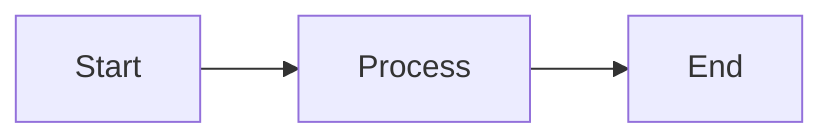

# Mermaid Cloud Viz

[](https://github.com/AndrewMichael2020/mermaid-exporter/actions/workflows/main.yml)
[](./LICENSE)
[](https://github.com/AndrewMichael2020/mermaid-exporter/issues)

**Create beautiful diagrams with AI assistance — no design skills required.**

An AI-powered application that makes creating professional diagrams as easy as describing what you need. Built with Next.js and powered by Google Gemini AI.

🌐 **[Try it live](https://mermaid-exporter-r34k7xewoa-uc.a.run.app)** (deployed on Google Cloud Run)


---

## 🎯 What Can You Do?

### For Everyone
- **💬 Describe, Don't Draw** — Type what you want (e.g., "workflow for customer onboarding"), and AI generates the diagram
- **✨ Instant Visualization** — See your diagram update in real-time as you type
- **🎨 Professional Quality** — Export high-quality SVG files ready for presentations and docs
- **📚 Start from Examples** — Browse our gallery of pre-built diagrams and customize them
- **🤖 AI Enhancement** — Ask AI to improve, restructure, or add details to any diagram

### What Are Mermaid Diagrams?
[Mermaid](https://mermaid.js.org) is a simple text format for creating diagrams. Instead of dragging boxes around, you write:


Our app makes this even easier — just tell AI what you want, and it writes the code for you!

---

## 🚀 Quick Start (Users)

1. **Visit** [the live app](https://mermaid-exporter-r34k7xewoa-uc.a.run.app)
2. **Try the AI generator:**
   - Click "Generate with AI"
   - Describe your diagram (e.g., "flowchart showing software release process")
   - Click Generate
3. **Or browse examples:**
   - Click "Gallery"
   - Pick a diagram template
   - Customize it to your needs
4. **Export your diagram:**
   - Click "Export SVG"
   - Use in presentations, docs, or websites

---

## 🛠️ For Developers

> **Want to contribute, deploy your own instance, or modify the code?**  
> See **[.github/workflows/CICD-STRATEGY.md](.github/workflows/CICD-STRATEGY.md)** for complete setup, deployment, and CI/CD documentation.

### Quick Local Setup

```bash
# Clone and install
git clone https://github.com/AndrewMichael2020/mermaid-exporter.git
cd mermaid-exporter
npm install

# Start AI server (terminal 1)
npm run genkit:dev

# Start web app (terminal 2)
npm run dev

# Open http://localhost:9005
```

**Configuration:**
- Copy `.env.local.example` to `.env.local`
- Add your Firebase and Gemini API keys
- See [CICD-STRATEGY.md](.github/workflows/CICD-STRATEGY.md) for detailed setup instructions

### Deploy Your Own Instance

Full deployment guide with infrastructure setup, IAM permissions, and CI/CD automation:
👉 **[.github/workflows/CICD-STRATEGY.md](.github/workflows/CICD-STRATEGY.md)**

--- 

---

## 🤝 Contributing

Contributions are welcome! Please feel free to submit a Pull Request.

1. Fork the project
2. Create your feature branch (`git checkout -b feature/AmazingFeature`)
3. Commit your changes (`git commit -m 'Add some AmazingFeature'`)
4. Push to the branch (`git push origin feature/AmazingFeature`)
5. Open a Pull Request

## 📄 License

Distributed under the MIT License. See [`LICENSE`](./LICENSE) for more information.

## 🙏 Acknowledgments

- [Mermaid.js](https://mermaid.js.org) — The diagram rendering engine
- [Google Gemini](https://ai.google.dev) — AI model powering diagram generation
- [Next.js](https://nextjs.org) — React framework
- [Tailwind CSS](https://tailwindcss.com) — Styling framework
- [shadcn/ui](https://ui.shadcn.com) — UI components

## 📞 Support

- 🐛 [Report a bug](https://github.com/AndrewMichael2020/mermaid-exporter/issues/new?labels=bug)
- 💡 [Request a feature](https://github.com/AndrewMichael2020/mermaid-exporter/issues/new?labels=enhancement)
- 📖 [View documentation](./docs/)
- 🔧 [Deployment guide](.github/workflows/CICD-STRATEGY.md)

---

**Made with ❤️ using AI and open source**
