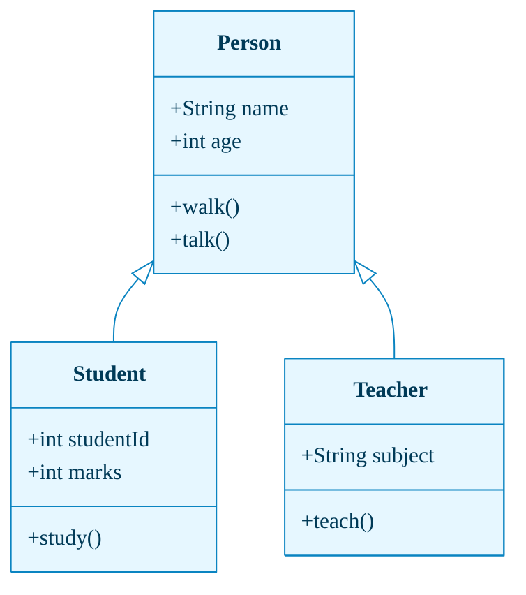
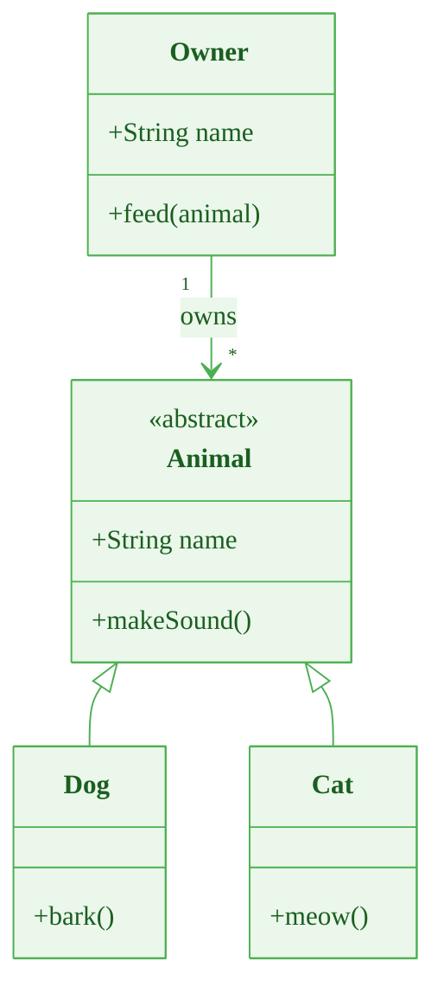

# Class Diagram with Global Theming

This example demonstrates class diagram theming. Note that **per-class coloring is NOT supported** in Mermaid v10.9.x — only global `themeVariables` apply.

## Basic Themed Class Diagram

## Class Diagram with Relationships

## Limitation Note

> ⚠️ **Per-class styling is not supported.** All class boxes share the same colors defined in `themeVariables`. If you need per-element coloring, consider using a flowchart with `classDef` styling to represent similar relationships visually.
