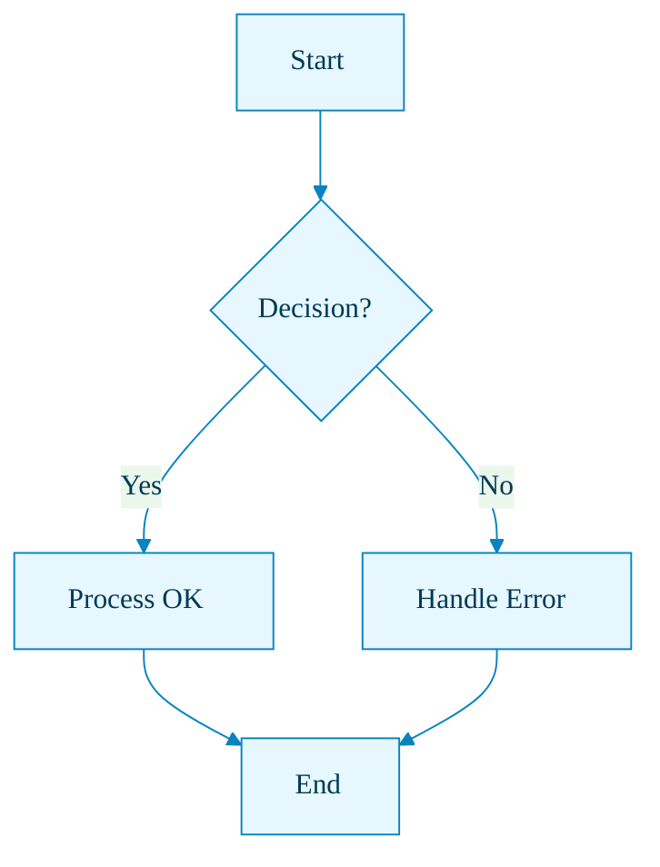
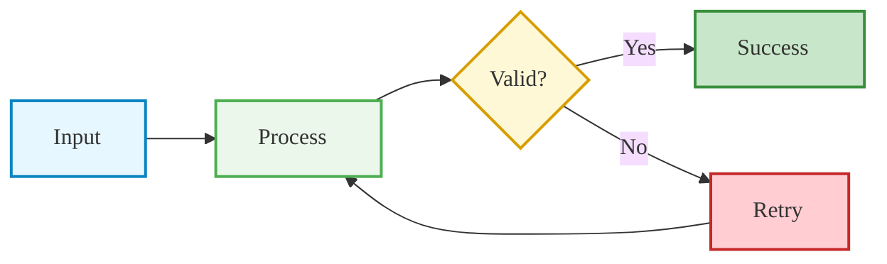
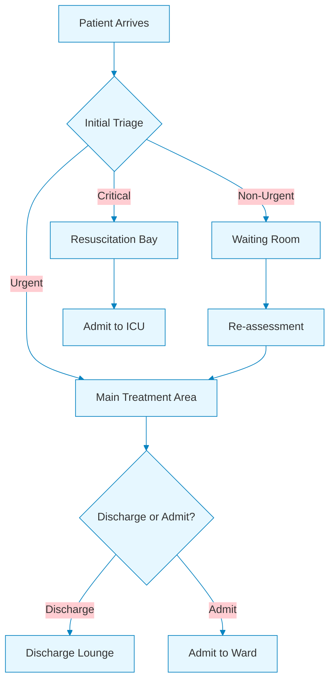

# Flowchart with Full Theming

This example demonstrates flowchart theming with both `themeVariables` and `classDef` styling.

## Basic Themed Flowchart

## Flowchart with classDef Styling

## Hospital Workflow Example

