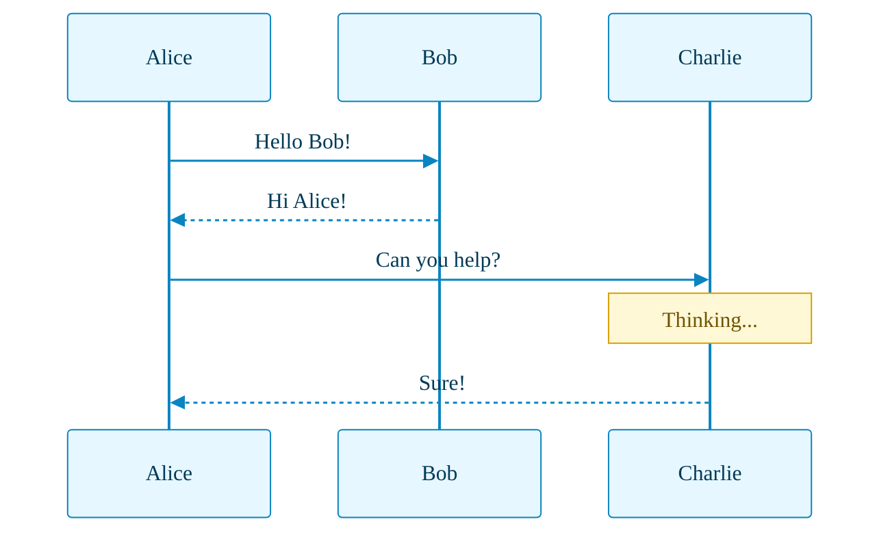
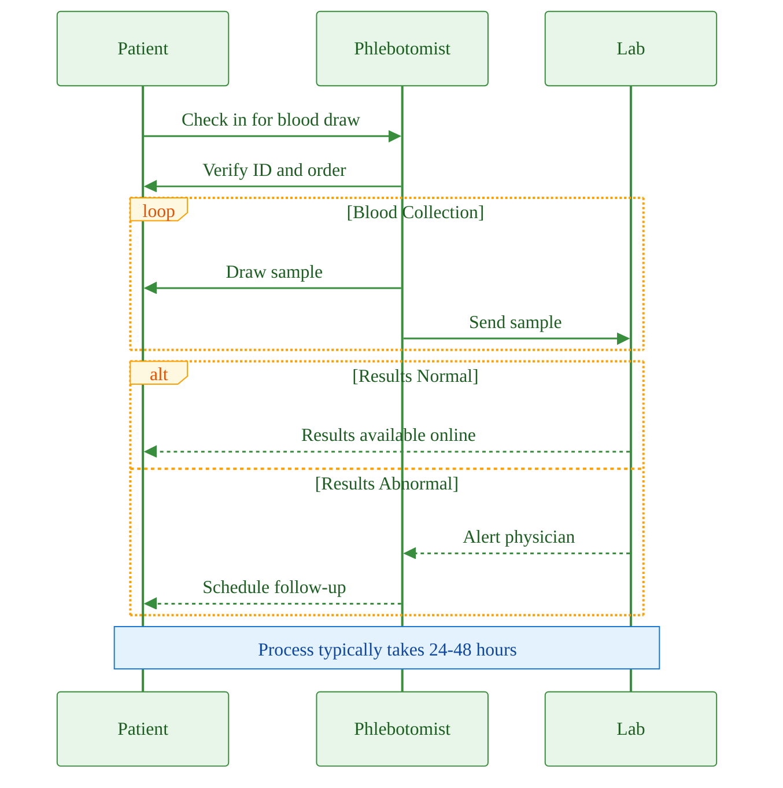

# Sequence Diagram with Palette Theming

This example demonstrates sequence diagram theming. Note that **per-actor/per-message coloring is NOT supported** in Mermaid v10.9.x — only palette-level `themeVariables` apply. All actors share the same background/border colors.

## Basic Themed Sequence Diagram

## Sequence Diagram with Loops and Alt

## Limitation Note

> ⚠️ **Per-actor and per-message styling is not supported.** All actors share the same `actorBkg`/`actorBorder` colors. All messages share the same `signalColor`. This is a Mermaid limitation in v10.9.x.
