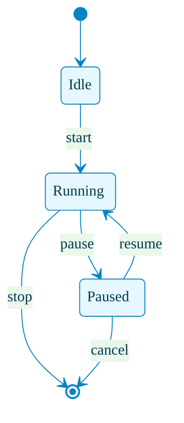
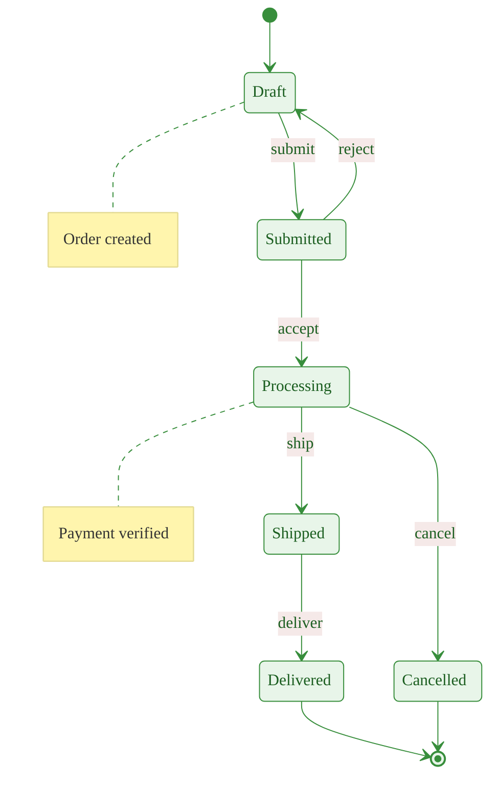
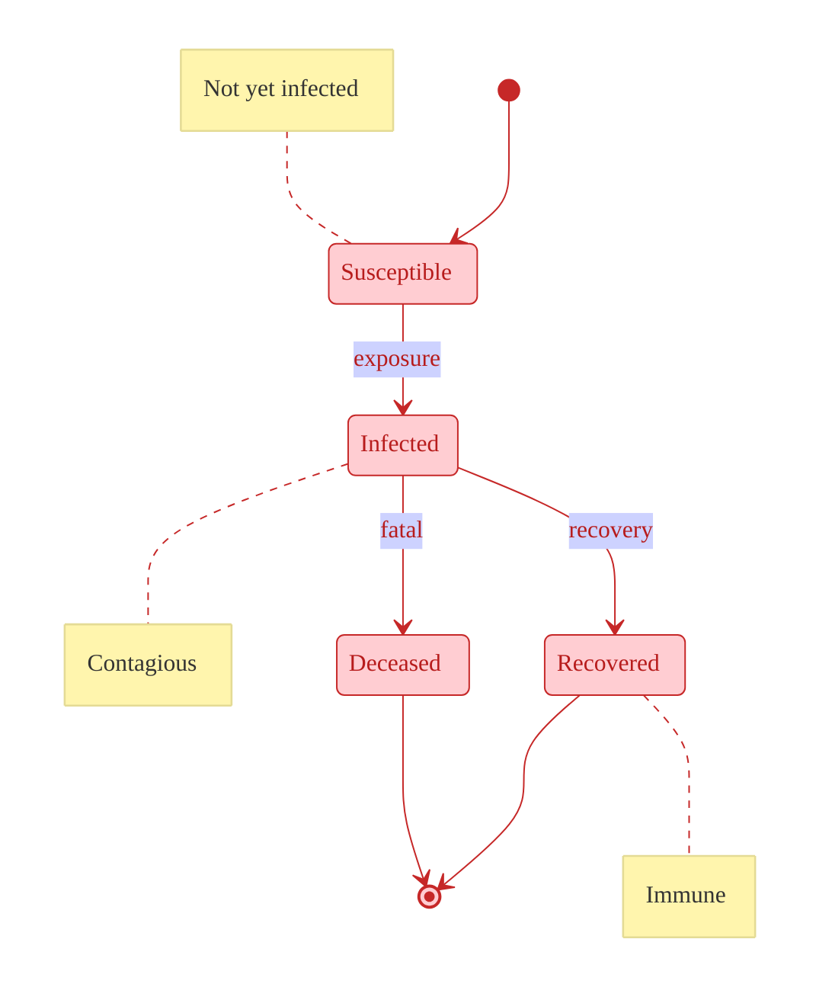

# State Diagram with Theming

This example demonstrates state diagram theming with `themeVariables`. State diagrams support global theming similar to flowcharts.

## Basic Themed State Diagram

## Order Processing State Machine

## Epidemic State Model (SIR)

