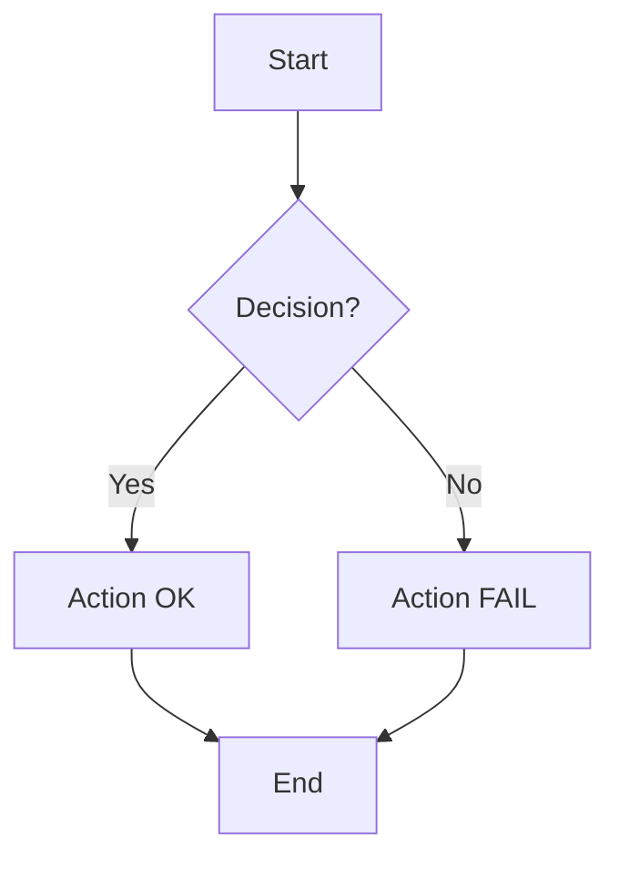
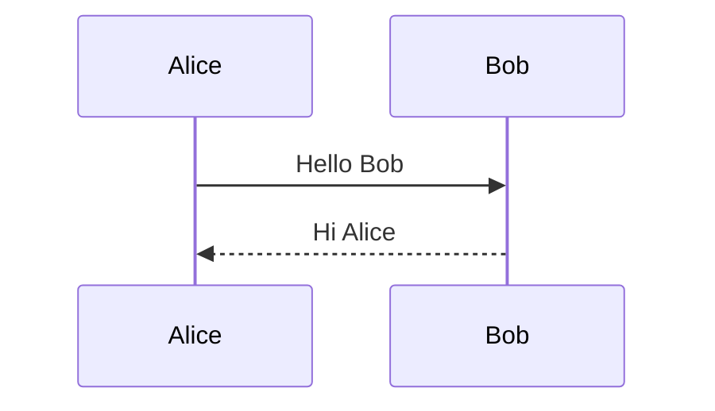
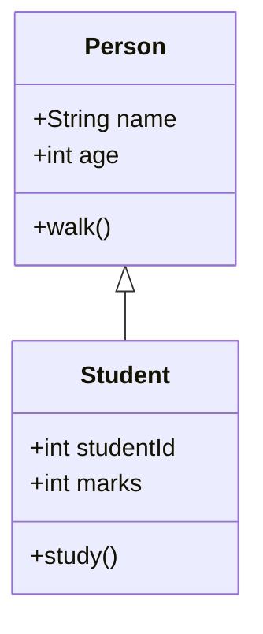
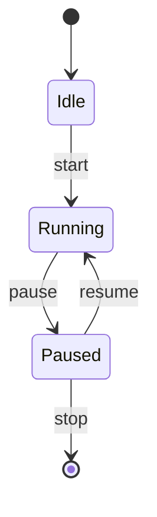
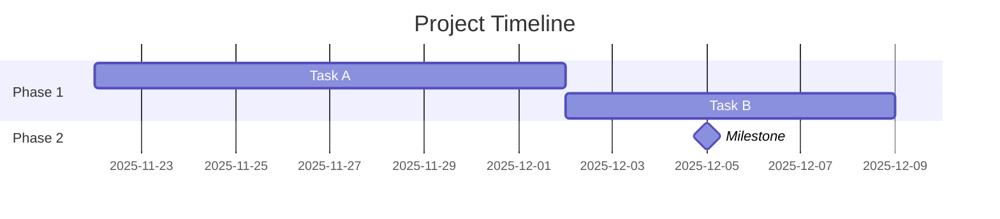
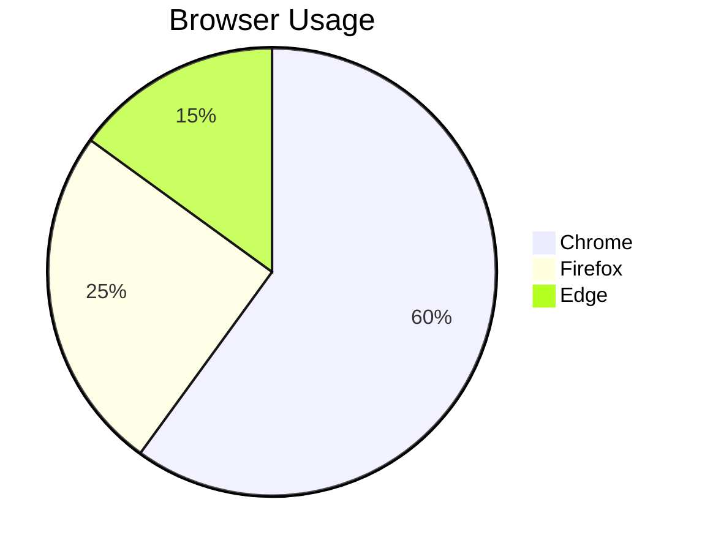
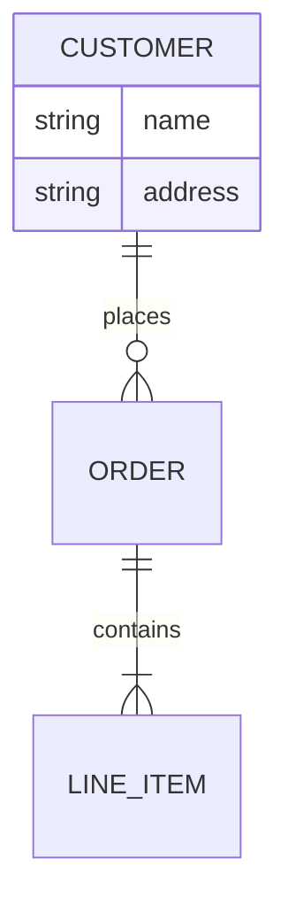
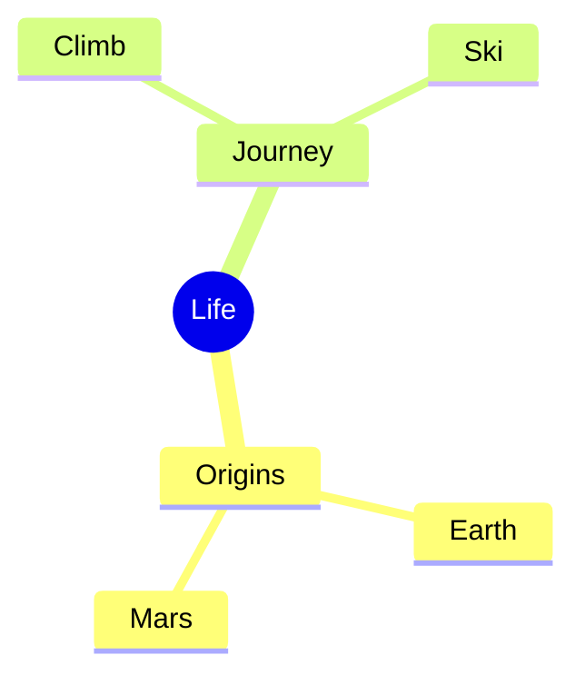
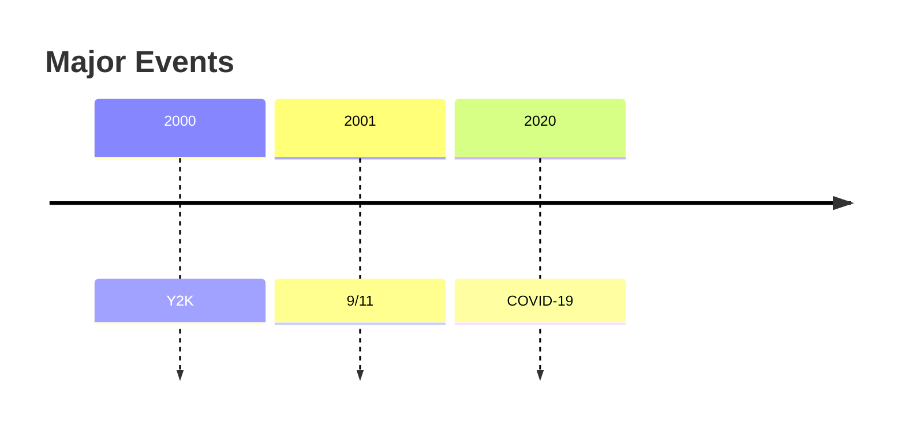
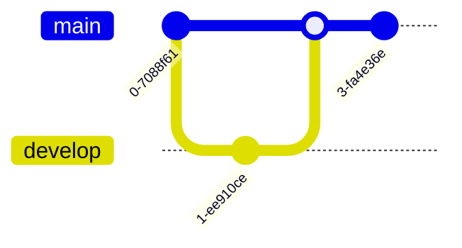

# Mermaid Diagram Types — Reference & Examples

This document outlines the major diagram/chart types supported by Mermaid (version 10.9.x) along with minimal working code examples.

> **Theming Support:** For detailed information about theming capabilities per diagram type, see [Theming Support Reference](./theming_support.md). For colorized examples, see the [examples/](./examples/) folder.

## 1. Flowchart


## 2. Sequence Diagram


## 3. Class Diagram


## 4. State Diagram


## 5. Gantt Chart


## 6. Pie Chart


## 7. ER Diagram


## 8. Mindmap


## 9. Timeline


## 10. Sankey Diagram
```mermaid
sankey
  A[Source] --> B[Flow] : 5
  B --> C[Destination] : 5
```

## 11. C4 Diagram
```mermaid
C4Diagram
  Person(user, "User")
  System(system, "System")
  user --> system : uses
```

## 12. Block Diagram
```mermaid
blockDiagram
  system --> subsystem1
  system --> subsystem2
  subsystem1 --> componentA
  subsystem2 --> componentB
```

## 13. XY Chart
```mermaid
xyChart
  title Sales vs Time
  xAxis label Time
  yAxis label Sales
  "Jan": 30, "Feb": 45, "Mar": 60
```

## 14. Quadrant Chart
```mermaid
quadrantChart
  title Risk vs Reward
  "Low Risk/High Reward": 10
  "High Risk/High Reward": 5
  "Low Risk/Low Reward": 2
  "High Risk/Low Reward": 1
```

## 15. Git Graph

