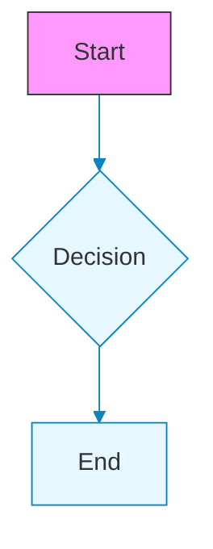
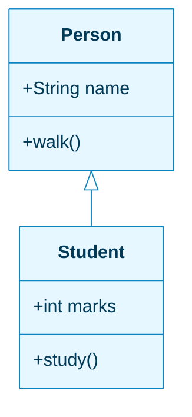
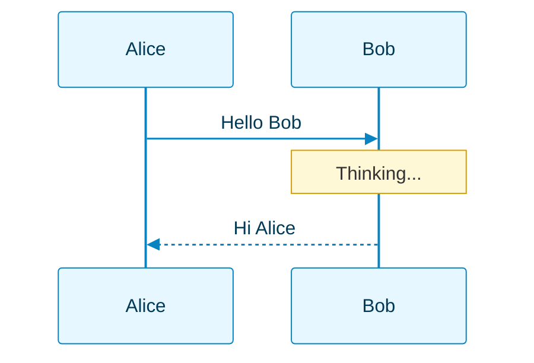
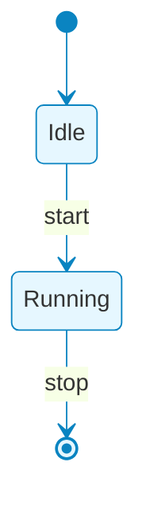
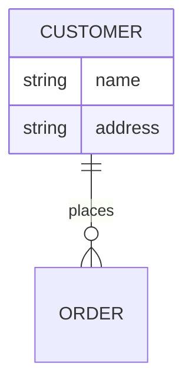

# Mermaid Theming Support Reference

This document describes the theming and styling capabilities for each diagram type in Mermaid v10.9.1, as used by this application.

## Overview

Mermaid supports theming via two primary mechanisms:
1. **`%%{init: { "themeVariables": {...} }}%%`** — Global theme variables applied to the entire diagram
2. **`classDef` / `class`** — Per-node styling (only supported in specific diagram types)

### Important Limitations

- **Per-node/per-actor coloring is NOT supported** for most diagram types in Mermaid v10.9.x
- `classDef` syntax is only available for flowcharts and state diagrams
- classDiagram and sequenceDiagram only support **global/palette-level** theming
- ER diagrams should not include theming blocks (styling is intentionally omitted)

---

## Theming Support by Diagram Type

### ✅ Flowchart / Graph TD — Full Support

Flowcharts support both global `themeVariables` and per-node `classDef` styling.

**Supported themeVariables:**
- `primaryColor`, `primaryBorderColor`, `primaryTextColor`
- `secondaryColor`, `secondaryBorderColor`, `secondaryTextColor`
- `tertiaryColor`, `tertiaryBorderColor`, `tertiaryTextColor`
- `lineColor`, `fontFamily`

**classDef support:** ✅ Yes

---

### ⚠️ Class Diagram — Global Only

classDiagram supports `themeVariables` for global styling, but **per-class coloring is NOT supported** in Mermaid v10.9.x. All class boxes will use the same colors defined in the theme.

**Supported themeVariables:**
- `primaryColor` — Background color for class boxes
- `primaryBorderColor` — Border color for class boxes
- `primaryTextColor` — Text color
- `lineColor` — Relationship line color
- `fontFamily`

**classDef support:** ❌ No

> **Note:** If you need per-class coloring, consider using a flowchart with classDef styling to represent similar relationships.

---

### ⚠️ Sequence Diagram — Palette Level Only

sequenceDiagram supports `themeVariables` for global actor/signal/note styling, but **per-actor or per-message coloring is NOT supported** in Mermaid v10.9.x. All actors share the same background/border colors, and all messages share the same signal colors.

**Supported themeVariables:**
- `actorBkg` — Actor box background color
- `actorBorder` — Actor box border color
- `actorTextColor` — Actor label text color
- `signalColor` — Message arrow color
- `signalTextColor` — Message text color
- `labelBoxBkgColor` — Label box background (e.g., loop/alt labels)
- `labelBoxBorderColor` — Label box border color
- `labelTextColor` — Label text color
- `loopTextColor` — Loop text color
- `noteBkgColor` — Note background color
- `noteBorderColor` — Note border color
- `noteTextColor` — Note text color
- `fontFamily`

**Per-actor styling:** ❌ Not supported
**Per-message styling:** ❌ Not supported

> **Note:** If you need per-actor coloring, this is a Mermaid limitation. All actors will share the same palette.

---

### ✅ State Diagram — Full Support

stateDiagram-v2 supports both global `themeVariables` and limited `classDef` styling for states.

**Supported themeVariables:**
- `primaryColor`, `primaryBorderColor`, `primaryTextColor`
- `secondaryColor`, `secondaryBorderColor`, `secondaryTextColor`
- `tertiaryColor`, `tertiaryBorderColor`, `tertiaryTextColor`
- `lineColor`, `fontFamily`

**classDef support:** ✅ Partial (for states)

---

### ❌ ER Diagram — No Theming

ER diagrams do not support `themeVariables` or custom styling. The Generate/Enhance functions intentionally exclude theme blocks for ER diagrams to avoid rendering issues.

**themeVariables support:** ❌ Not recommended
**classDef support:** ❌ No

---

### Other Diagram Types

| Diagram Type | themeVariables | classDef | Notes |
|--------------|----------------|----------|-------|
| Gantt | ✅ Partial | ❌ | Limited styling options |
| Pie | ✅ Partial | ❌ | Section colors via themeVariables |
| Mindmap | ✅ Partial | ❌ | Node colors via themeVariables |
| Timeline | ✅ Partial | ❌ | Limited styling |
| Git Graph | ✅ Partial | ❌ | Branch colors via themeVariables |
| Journey | ✅ Partial | ❌ | Actor colors via themeVariables |

---

## Generate/Enhance Behavior

The AI-powered Generate and Enhance features in this application:

1. **Automatically include** `themeVariables` blocks for supported diagram types
2. **Preserve existing** theme blocks when enhancing diagrams
3. **Exclude theming** for ER diagrams (intentional)
4. **Cannot produce** per-node/per-actor styling for diagrams that don't support it

### What to Expect

| Diagram Type | Generate/Enhance Output |
|--------------|------------------------|
| Flowchart | ✅ Full theming + optional classDef |
| classDiagram | ✅ Global themeVariables only |
| sequenceDiagram | ✅ Global actor/signal colors only |
| stateDiagram | ✅ Full theming |
| erDiagram | ❌ No theming (intentional) |

---

## Future Compatibility

If future Mermaid releases add per-class or per-actor coloring support, this application will be updated to take advantage of those features. Check the [Mermaid changelog](https://github.com/mermaid-js/mermaid/releases) for updates.

When upgrading Mermaid versions, re-verify theming behavior using the integration tests provided in this repository.
